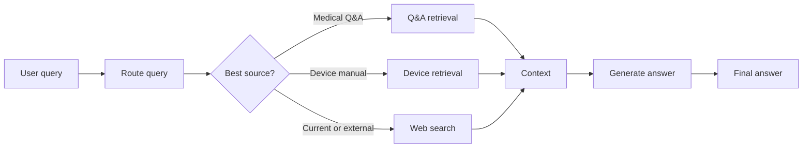

# Agentic RAG

Agentic RAG is a small, production-oriented Python project for evaluating a
medical question-answering system that can choose between local retrieval and
web fallback.

The project is designed as a practical AI evaluation playground. It demonstrates
how to move from "the demo worked" to measurable, inspectable engineering
signals: routing accuracy, retrieval quality, fallback behavior, answer-quality
proxies, traces, and ablation experiments.

## What The System Does

Given a user query, the pipeline:

1. Routes the query to the most appropriate source.
2. Retrieves context from a local Chroma collection when the source is local.
3. Falls back to web search for recent, external, or out-of-domain questions.
4. Builds a compact prompt from the retrieved context.
5. Generates a short final answer.
6. Records row-level evaluation outputs and optional OpenTelemetry traces.

Supported routes:

- `Retrieve_QnA`: general medical questions such as symptoms, risks, prevention,
  and treatment.
- `Retrieve_Device`: medical-device/manual questions such as model numbers,
  contraindications, manufacturers, patient populations, and usage details.
- `Web_Search`: current facts, recent news, future events, or questions outside
  the local datasets.

## Use Case Flow



## Why This Repo Exists

The main lesson is that agentic systems should be evaluated one stage at a time.
End-to-end quality matters, but it is hard to debug unless each upstream decision
is visible.

This repo breaks the system into an evaluation ladder:

- Data and Chroma sanity checks before trusting any metric.
- Router evaluation before retrieval evaluation.
- Retrieval evaluation before answer-quality evaluation.
- Cascade evaluation to show how route errors affect retrieval.
- Fallback evaluation to decide when local context is not good enough.
- Full benchmark runs for end-to-end summaries.
- Ablations to compare variants and decide what to improve next.

## Repository Layout

```text
.
├── datasets/
│   ├── medical_qna_dataset.csv
│   ├── medical_device_manuals_dataset.csv
│   ├── evaluation_dataset.csv
│   └── challenging_router_evaluation_dataset.csv
├── docs/
│   └── *_theory.md
├── notebooks/
│   ├── 00_simple_agentic_rag.ipynb
│   ├── 01_data_and_chroma_sanity_check.ipynb
│   ├── 02_router_evaluation.ipynb
│   ├── 03_retrieval_evaluation.ipynb
│   ├── 04_router_retrieval_cascade.ipynb
│   ├── 05_relevance_and_web_fallback.ipynb
│   ├── 06_answer_quality_deepeval.ipynb
│   ├── 07_full_agentic_rag_benchmark.ipynb
│   └── 08_experiments_and_ablation.ipynb
├── src/agentic_rag/
│   ├── cli.py
│   ├── constants.py
│   ├── evaluation.py
│   ├── ingestion.py
│   ├── llm.py
│   ├── pipeline.py
│   ├── retrievers.py
│   ├── router.py
│   ├── schemas.py
│   ├── settings.py
│   ├── telemetry.py
│   └── web_search.py
└── tests/
    ├── unit/
    ├── integration/
    └── e2e/
```

The importable package lives at `src/agentic_rag`. The distribution name uses a
hyphen (`agentic-rag`), while Python imports use an underscore:

```python
from agentic_rag import AgenticRAG, Settings
```

## Core Modules

- `agentic_rag.router.QueryRouter`: chooses `Retrieve_QnA`,
  `Retrieve_Device`, or `Web_Search`. It supports a deterministic heuristic mode
  and an LLM-backed mode.
- `agentic_rag.retrievers.ChromaRetriever`: queries the relevant Chroma
  collection using deterministic local embeddings.
- `agentic_rag.ingestion.ensure_chroma_collections`: creates and populates the
  local Chroma collections from the CSV datasets.
- `agentic_rag.pipeline.AgenticRAG`: connects routing, retrieval/web search, and
  answer generation.
- `agentic_rag.evaluation`: loads evaluation examples, resolves gold document
  IDs, computes retrieval metrics, and summarizes route/retrieval performance.
- `agentic_rag.telemetry`: configures OpenTelemetry spans for local debugging or
  OTLP export.

## Evaluation Ladder

Each notebook has a matching theory note in `docs/`.

| Step | Notebook | Focus |
| --- | --- | --- |
| 00 | `00_simple_agentic_rag.ipynb` | Minimal end-to-end system walkthrough |
| 01 | `01_data_and_chroma_sanity_check.ipynb` | Dataset schema, missing values, collection counts, smoke retrieval |
| 02 | `02_router_evaluation.ipynb` | Router accuracy, precision/recall/F1 by route, confusion matrix |
| 03 | `03_retrieval_evaluation.ipynb` | Precision@k, Recall@k, Hit@k, MRR, top-k behavior |
| 04 | `04_router_retrieval_cascade.ipynb` | Expected-source vs predicted-source retrieval |
| 05 | `05_relevance_and_web_fallback.ipynb` | Context relevance and web fallback policy |
| 06 | `06_answer_quality_deepeval.ipynb` | Answer-quality proxies and optional DeepEval scoring |
| 07 | `07_full_agentic_rag_benchmark.ipynb` | End-to-end route, retrieve, fallback, answer, latency summary |
| 08 | `08_experiments_and_ablation.ipynb` | Variant comparison and failure analysis |

Use the component notebooks to debug. Use the full benchmark to summarize.

## Setup

This project uses `uv` and requires Python `>=3.14,<3.15`.

```bash
uv sync --extra dev
```

Optional environment variables can be placed in `.env` or exported in the shell:

```bash
OPENAI_API_KEY=...
TAVILY_API_KEY=...
```

OpenAI is needed for LLM-backed generation and router mode `llm`. Tavily is
needed for live web-search fallback. The local ingestion/retrieval pieces use
deterministic embeddings and do not require model downloads.

## Common Commands

Run tests:

```bash
uv run pytest
```

Run a specific test tier:

```bash
uv run pytest tests/unit
uv run pytest tests/integration
uv run pytest tests/e2e
```

Run linting and type checks:

```bash
uv run ruff check .
uv run mypy
```

Run the package evaluation CLI:

```bash
uv run agentic-rag-evaluate --dataset datasets/evaluation_dataset.csv
```

Run a smaller smoke evaluation:

```bash
uv run agentic-rag-evaluate \
  --dataset datasets/evaluation_dataset.csv \
  --max-examples 5
```

Compare router behavior with LLM routing:

```bash
uv run agentic-rag-evaluate \
  --dataset datasets/evaluation_dataset.csv \
  --router llm
```

The CLI writes:

- row-level results to `evaluation_results_package.csv`
- summary metrics to `evaluation_summary_package.json`

## Working With Notebooks

After installing the project with `uv sync --extra dev`, use the project
environment as the notebook kernel. Notebook examples should import from the
package rather than duplicating implementation logic:

```python
from agentic_rag.cli import build_pipeline
from agentic_rag.settings import Settings
```

The notebooks are intentionally ordered. Start with `01` before interpreting
router or retrieval metrics, because broken data or stale Chroma collections can
make downstream scores misleading.

## Configuration

Runtime settings are defined in `agentic_rag.settings.Settings`.

| Setting | Environment variable | Default |
| --- | --- | --- |
| OpenAI API key | `OPENAI_API_KEY` | `None` |
| Tavily API key | `TAVILY_API_KEY` | `None` |
| Chroma path | `CHROMA_PATH` | `./chroma_db` |
| Retrieval depth | `TOP_K` | `3` |
| Generation model | `GENERATION_MODEL` | `gpt-5-nano` |
| Evaluator model | `EVALUATOR_MODEL` | `gpt-5-nano` |
| OpenAI timeout | `OPENAI_TIMEOUT` | `60.0` |
| DeepEval timeout | `DEEPEVAL_TIMEOUT` | `120` |
| Tracing enabled | `OTEL_TRACING_ENABLED` | `false` |
| Trace exporter | `OTEL_TRACES_EXPORTER` | `console` |
| Trace file | `OTEL_TRACES_FILE` | `otel_traces/agentic_rag_traces.jsonl` |
| OTLP endpoint | `OTEL_EXPORTER_OTLP_ENDPOINT` | `None` |

## Tracing

OpenTelemetry tracing is disabled by default. Enable local console spans with:

```bash
OTEL_TRACING_ENABLED=true \
OTEL_TRACES_EXPORTER=console \
uv run agentic-rag-evaluate --dataset datasets/evaluation_dataset.csv --max-examples 1
```

Write traces to a local JSONL-style file:

```bash
OTEL_TRACING_ENABLED=true \
OTEL_TRACES_EXPORTER=file \
OTEL_TRACES_FILE=otel_traces/agentic_rag_traces.jsonl \
uv run agentic-rag-evaluate --dataset datasets/evaluation_dataset.csv --max-examples 1
```

Export to an OTLP collector:

```bash
OTEL_TRACING_ENABLED=true \
OTEL_TRACES_EXPORTER=otlp \
OTEL_EXPORTER_OTLP_ENDPOINT=http://localhost:4317 \
uv run agentic-rag-evaluate --dataset datasets/evaluation_dataset.csv --max-examples 1
```

Useful spans include:

- `router.route`
- `retriever.chroma.query`
- `agentic_rag.get_context`
- `llm.generate`
- `web_search.tavily`
- `evaluation.evaluate_one`
- `evaluation.evaluate_examples`

## Metrics

Router metrics:

- accuracy
- precision, recall, and F1 per route
- confusion matrix

Retrieval metrics:

- `Precision@k`: how many retrieved documents are relevant
- `Recall@k`: how many expected documents were found
- `Hit@k`: whether at least one expected document appears in the top-k results
- `MRR`: how early the first correct document appears

Answer-quality metrics:

- local context existence
- lexical relevance proxies
- expected-answer overlap
- optional DeepEval answer relevancy scoring

The project treats LLM-as-judge scores as useful proxies, not ground truth.

## Development Notes

Run the quality gate before committing:

```bash
uv run pytest
uv run ruff check .
uv run mypy
```

Keep implementation code in `src/agentic_rag`. Keep exploratory workflows in
`notebooks/`, and keep the conceptual explanation for each workflow in `docs/`.
When adding a new evaluation, prefer making its row-level outputs inspectable
before optimizing aggregate metrics.

## Practical Teaching Flow

For a workshop or meetup, a good walkthrough is:

1. Start with the problem: demos are not evidence of quality.
2. Show the route labels in `constants.py`.
3. Show the router in `router.py`.
4. Show the pipeline in `pipeline.py`.
5. Run or inspect router evaluation in notebook `02`.
6. Move to retrieval evaluation in notebook `03`.
7. Show cascade failures in notebook `04`.
8. Finish with tracing and the full benchmark.

That arc connects the theory directly to code: define correctness, create a
golden set, measure one component, inspect failures, then only later trust the
end-to-end summary.
